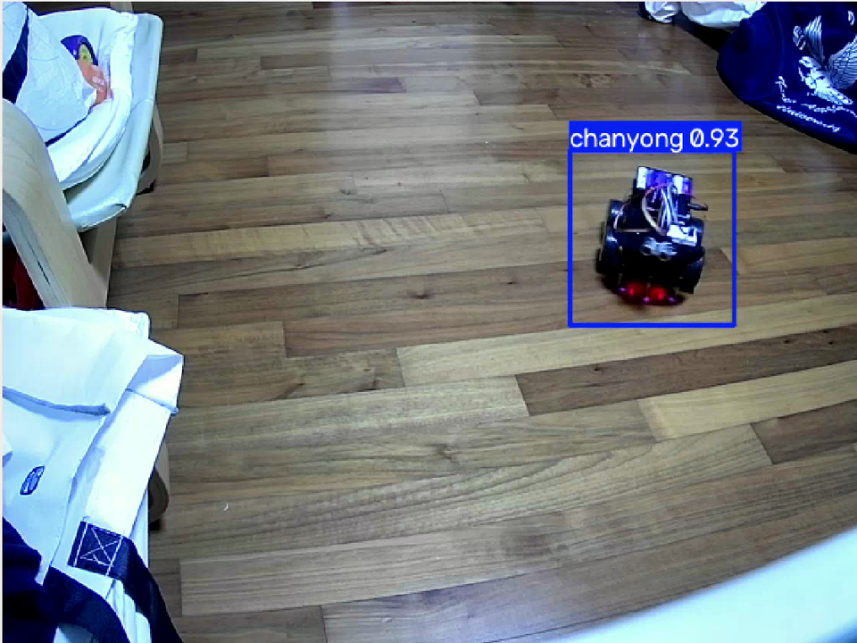
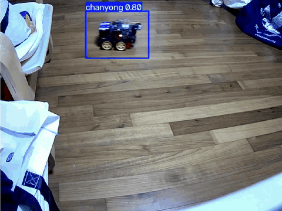
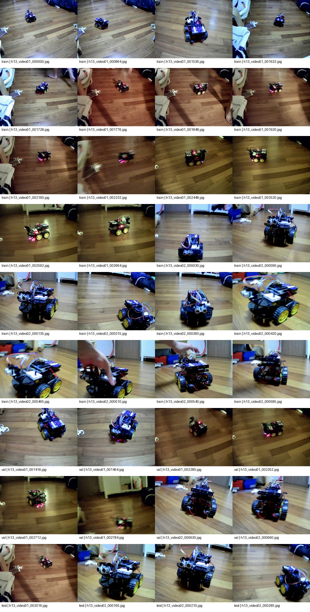
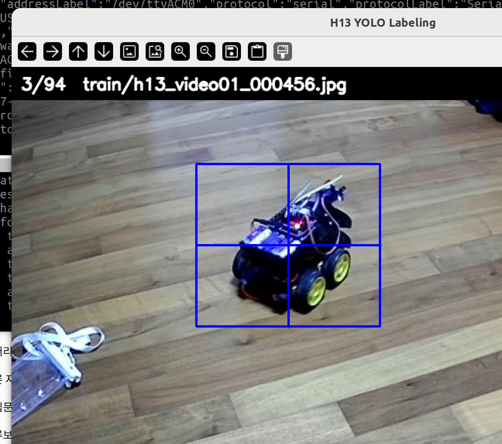
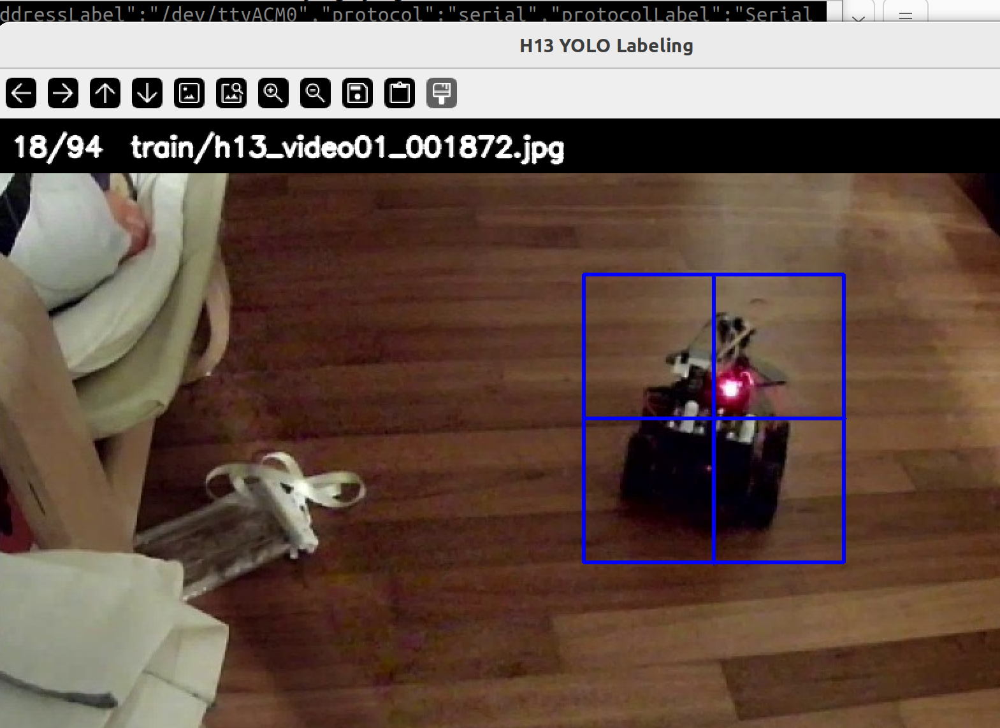
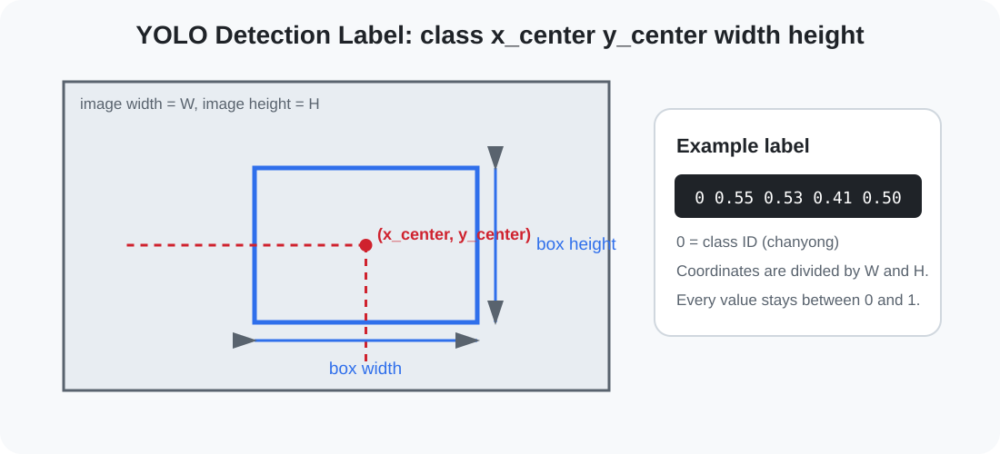
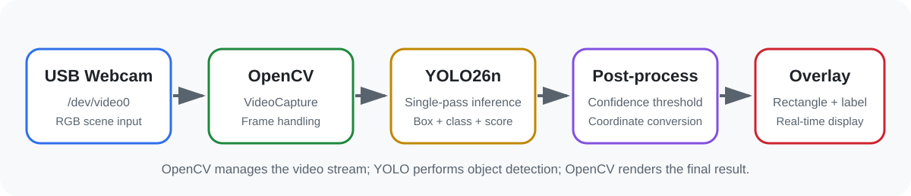
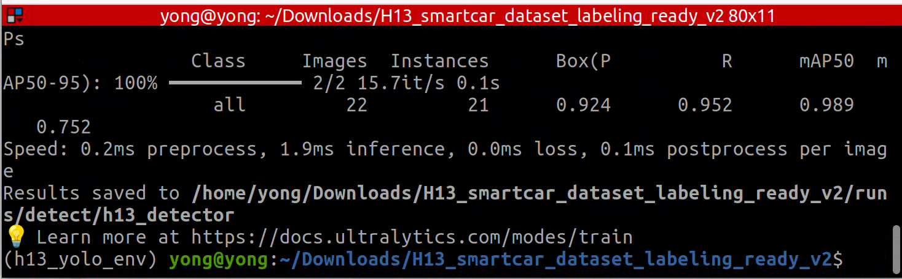
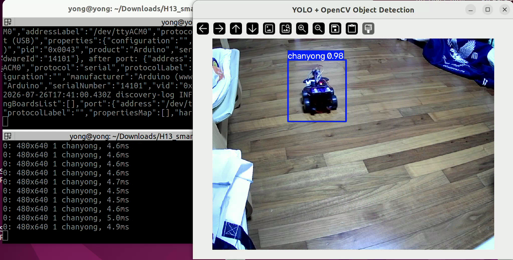

# YOLO 및 OpenCV 기반 실시간 객체 검출 프로젝트

<p align="center">
  <strong>웹캠 영상 수집 → 프레임 데이터셋 구성 → 직접 바운딩 박스 라벨링 → YOLO 학습 → OpenCV 실시간 검출</strong>
</p>

<p align="center">
  
</p>

## 프로젝트 개요

이 프로젝트는 USB 웹캠으로 촬영한 영상에서 사용자 지정 객체를 검출하도록 YOLO 모델을 학습하고, OpenCV로 실시간 카메라 영상을 입력받아 바운딩 박스와 confidence를 표시한 프로젝트다.

## 실행 데모

### 기본 검출

<p align="center">
  
</p>

[기본 검출 MP4](assets/demo/realtime_detection.mp4)

### 다른 차량을 함께 배치한 환경

<p align="center">
  
</p>

[다른 차량 환경 MP4](assets/demo/distractor_environment_test.mp4)

이 테스트는 주변에 형태가 비슷한 다른 차량을 함께 배치한 상태에서 학습 대상 객체가 구분되는지 확인한 실험이다.

## 실제 진행 과정

이번 프로젝트에서 수행한 순서는 다음과 같다.

1. 외장 USB 웹캠을 `/dev/video0`으로 연결했다.
2. 객체를 여러 거리와 방향에서 움직이며 두 개의 영상을 촬영했다.
3. 촬영 영상에서 일정 간격으로 프레임을 추출하고, 중복되거나 활용하기 어려운 장면을 제외해 총 94장의 데이터셋을 구성했다.
4. 추출한 이미지를 Train 62장, Validation 22장, Test 10장으로 분할했다.
5. `label_h13.py`를 이용해 이미지마다 객체 전체를 바운딩 박스로 직접 지정했다.
6. `validate_labels.py`로 누락되거나 잘못된 YOLO 라벨이 없는지 검사했다.
7. 터미널의 `yolo detect train` 명령으로 80 epochs 학습했다.
8. `src/detect_webcam.py`로 OpenCV 웹캠 실시간 검출을 실행했다.
9. 같은 객체에 박스가 중복 표시되는 문제를 줄이기 위해 단일 대상 실험에서 `max_det=1`을 사용했다.
10. 다른 차량을 함께 둔 환경에서도 검출 결과를 확인했다.

## 데이터셋

<p align="center">
  
</p>

| 구분 | 이미지 수 |
|---|---:|
| Train | 62 |
| Validation | 22 |
| Test | 10 |
| **합계** | **94** |

데이터셋은 촬영한 두 개의 영상에서 일정 간격으로 프레임을 추출한 뒤, 화면이 가려진 장면과 중복도가 높은 장면을 제외하는 방식으로 구성했다. 이후 학습, 검증, 테스트 세트로 분할해 모델 학습과 성능 확인에 사용했다.

촬영 데이터에는 다음 변화가 포함된다.

- 정면, 측면, 후면, 대각선
- 원거리, 중거리, 근거리
- 화면 왼쪽, 중앙, 오른쪽 위치
- 밝기 변화와 그림자
- 이동 중 발생한 흐림
- 일부 가림과 화면 밖 이동

## 라벨링

<table>
  <tr>
    <td align="center"></td>
    <td align="center"></td>
  </tr>
</table>

각 이미지에서 바퀴, 차체, 센서와 배선을 포함한 객체 전체를 일정하게 감싸도록 라벨링했다. YOLO 라벨은 다음 형식을 사용한다.

```text
class_id x_center y_center width height
```

네 개의 좌표 값은 이미지 크기에 대해 `0~1`로 정규화된다.

<p align="center">
  
</p>

## OpenCV와 YOLO의 역할

<p align="center">
  
</p>

### OpenCV

OpenCV는 웹캠 장치를 열고 프레임을 읽으며, 라벨링 화면과 실시간 결과 창을 표시한다. 최종 코드에서는 카메라 해상도를 `640×480`으로 설정해 화면 크기와 처리 부담을 낮췄다.

### YOLO

YOLO는 각 프레임에서 객체의 위치, 클래스, confidence를 예측한다. 이번 프로젝트에서는 사전학습 모델에서 시작해 직접 만든 한 개 클래스 데이터셋으로 미세조정했다.

### Confidence, IoU, NMS

- **Confidence**는 검출 결과를 얼마나 확신하는지를 나타낸다.
- **IoU**는 두 바운딩 박스가 얼마나 겹치는지 나타낸다.
- **NMS**는 서로 많이 겹치는 후보 중 낮은 confidence 박스를 제거한다.
- `max_det=1`은 한 화면에 실제 학습 대상이 한 개만 존재하는 이번 데모 조건에 맞춰 최종 검출 수를 한 개로 제한한다.

`max_det=1`은 모델을 다시 학습시키는 설정이 아니다. 여러 개의 학습 대상을 동시에 검출해야 한다면 값을 늘려야 한다.

## 학습 설정과 결과

사용한 학습 명령은 다음과 같다.

```bash
yolo detect train \
  model=yolo26n.pt \
  data=data_AFTER_LABELING.yaml \
  epochs=80 \
  imgsz=640 \
  batch=8 \
  name=h13_detector
```

| 항목 | 값 |
|---|---:|
| Precision | 0.924 |
| Recall | 0.952 |
| mAP50 | 0.989 |
| mAP50-95 | 0.752 |

<p align="center">
  
</p>

> 데이터가 두 개의 연속 영상에서 추출되었기 때문에 인접 프레임끼리 배경과 자세가 비슷하다. 따라서 완전히 새로운 장소와 조명에서 촬영한 독립 데이터로 추가 검증할 필요가 있다.

## 설치

```bash
python3 -m venv ~/h13_yolo_env
source ~/h13_yolo_env/bin/activate
python -m pip install --upgrade pip
pip install -r requirements.txt
```

## 라벨링 실행

저장소 루트에 있는 이미지 폴더를 기준으로 실행한다.

```bash
python3 label_h13.py
```

조작 방법:

```text
마우스 드래그     객체 박스 지정
Enter 또는 Space  박스 저장
C                 선택 취소 후 터미널에서 재시도/객체 없음/종료 선택
```

## 라벨 검사

```bash
python3 validate_labels.py
```

정상이라면 다음 문장이 출력된다.

```text
Validation passed. The dataset is ready for YOLO training.
```

## 실시간 검출 실행

먼저 사용자 컴퓨터에서 생성한 모델을 다음 위치에 복사한다.

```text
weights/best_chanyong.pt
```

그다음 실행한다.

```bash
python3 -u src/detect_webcam.py \
  --model weights/best_chanyong.pt \
  --camera 0 \
  --conf 0.40 \
  --iou 0.45 \
  --imgsz 480 \
  --width 640 \
  --height 480 \
  --max-det 1
```

터미널에는 아래처럼 짧은 로그가 출력된다.

```text
0: 480x640 1 chanyong, 4.9ms
0: 480x640 (no detections), 4.6ms
```

- `480x640`: 입력 프레임 높이와 너비
- `1 chanyong`: 검출한 객체 수와 클래스 이름
- `4.9ms`: YOLO 추론 시간
- `(no detections)`: confidence 기준을 통과한 검출이 없음

<p align="center">
  
</p>

## 프로젝트 구조

프로젝트 실행과 재현에 필요한 핵심 코드만 포함했다.

```text
yolo-opencv-object-detection/
├── README.md
├── requirements.txt
├── data_AFTER_LABELING.yaml
├── label_h13.py
├── validate_labels.py
├── src/
│   └── detect_webcam.py
├── images/
│   ├── train/
│   ├── val/
│   └── test/
├── labels/
│   ├── train/
│   ├── val/
│   └── test/
├── weights/
│   └── best_chanyong.pt
└── assets/
    ├── dataset/
    ├── demo/
    ├── diagrams/
    ├── labeling/
    └── results/
```

## 별도 보관 파일

학습 라벨과 최종 가중치 파일은 용량과 재사용 편의를 고려해 별도로 보관할 수 있다. 저장소에서 전체 파이프라인을 그대로 재현하려면 아래 경로에 파일을 배치한다.

```text
labels/train/*.txt
labels/val/*.txt
labels/test/*.txt
weights/best_chanyong.pt
```
